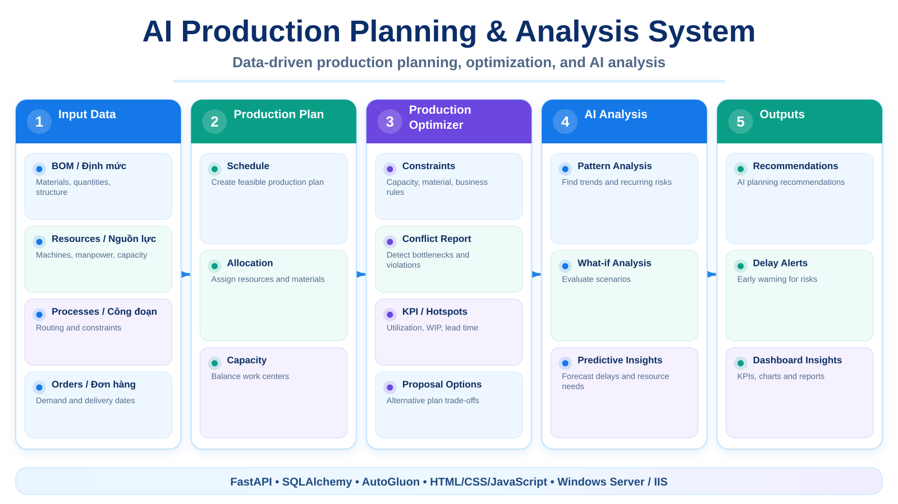

# 🏭 AI Production Planning & Analysis System

> Hệ thống quản lý và phân tích **kế hoạch sản xuất** kết hợp dữ liệu nghiệp vụ, constraint logic và AI để hỗ trợ lập kế hoạch, phát hiện xung đột và đánh giá nguồn lực.

  

---

## 📌 Giới thiệu

AI_Plan_analysis được xây dựng theo mô hình backend FastAPI + frontend web tĩnh. Hệ thống quản lý các thành phần chính của bài toán sản xuất như **định mức, nguồn lực, công đoạn, đơn hàng và kế hoạch**, sau đó cung cấp lớp AI để phân tích và đề xuất phương án kế hoạch.

Backend đồng thời phục vụ REST API và trực tiếp mount frontend để triển khai gọn trên một service.

---

## 🚀 Chức năng chính

- 📋 Quản lý **định mức sản xuất**.
- 👷 Quản lý **nguồn lực**.
- 🔄 Quản lý **công đoạn**.
- 📦 Quản lý **đơn hàng**.
- 🗓️ Quản lý **kế hoạch sản xuất** và chi tiết kế hoạch.
- ⚠️ Phát hiện kế hoạch trễ và cảnh báo.
- 🧠 Phân tích kế hoạch bằng AI.
- 🧩 Xây dựng constraint theo khoảng thời gian bận và quan hệ sản xuất.
- 📊 Tính KPI, hotspot và conflict report.
- 🔮 Dự báo/đánh giá nguồn lực bằng AutoGluon.
- 🖥️ Dashboard và các màn hình quản trị bằng HTML/CSS/JavaScript.

---

## 🏗️ Luồng xử lý

~~~text
Định mức + Nguồn lực + Công đoạn + Đơn hàng
                   │
                   ▼
           Kế hoạch sản xuất
                   │
                   ▼
       Production Optimizer
        ├── Constraints
        ├── Conflict Report
        ├── KPI / Hotspots
        └── Proposal Options
                   │
                   ▼
             AI Analysis
                   │
                   ▼
         Đề xuất / Cảnh báo
~~~

---

## 🔌 Nhóm API

Backend đăng ký các router dưới prefix /api/v1:

- dinh_muc_router
- nguon_luc_router
- cong_doan_router
- don_hang_router
- ke_hoach_router
- ai_plan_analysis_router
- plan_ai_router
- health

---

## 🛠️ Công nghệ sử dụng

### Backend
- 🐍 Python
- ⚡ FastAPI
- 🚀 Uvicorn
- 🗄️ SQLAlchemy
- 🤖 AutoGluon
- 📊 Pandas và các thư viện phân tích dữ liệu

### Frontend
- 🌐 HTML
- 🎨 CSS
- ⚙️ JavaScript

### Deployment
- 🪟 Windows Server
- 🌍 IIS + HttpPlatformHandler

---

## 📂 Cấu trúc dự án

~~~text
AI_Plan_analysis/
├── backend/
│   └── app/
│       ├── api/v1/                 # REST API routers
│       ├── ai_forecast/            # Forecast / AutoGluon
│       ├── ai_plan_analyzer/
│       │   └── production_optimizer/
│       ├── repositories/
│       ├── schemas/
│       └── services/
├── frontend/
│   ├── index.html
│   ├── pages/
│   └── assets/
│       ├── css/
│       └── js/
├── docs/
│   ├── SETUP_WINDOWS_SERVER_IIS.md
│   └── requirements.txt
├── run_server.py
├── web.config
└── .env.example
~~~

---

## 🖥️ Các màn hình frontend

Source hiện có các màn hình:

- Dashboard
- Định mức
- Nguồn lực
- Đơn hàng
- Kế hoạch
- Kế hoạch AI
- Chi tiết kế hoạch
- Cảnh báo / cảnh báo kế hoạch trễ
- Thống kê

---

## ⚙️ Cài đặt và chạy

### 1. Clone source

~~~bash
git clone https://github.com/tttiuem2k3/AI_Plan_analysis.git
cd AI_Plan_analysis
~~~

### 2. Chuẩn bị môi trường

Tạo .env dựa trên .env.example, sau đó cài dependency theo file trong docs/.

~~~bash
pip install -r docs/requirements.txt
~~~

### 3. Chạy ứng dụng

~~~bash
python run_server.py
~~~

FastAPI sẽ phục vụ cả API và frontend đã mount trong frontend/.

---

## 🚀 Triển khai Windows Server

Quy trình cài Python, IIS và HttpPlatformHandler được ghi tại:

[docs/SETUP_WINDOWS_SERVER_IIS.md](./docs/SETUP_WINDOWS_SERVER_IIS.md)

---

## 📞 Liên hệ

- 📧 Email: tttiuem2k3@gmail.com
- 👥 LinkedIn: [Thịnh Trần](https://www.linkedin.com/in/thinh-tran-04122k3/)
- 💬 Zalo / Phone: +84 329966939 | +84 336639775

---
